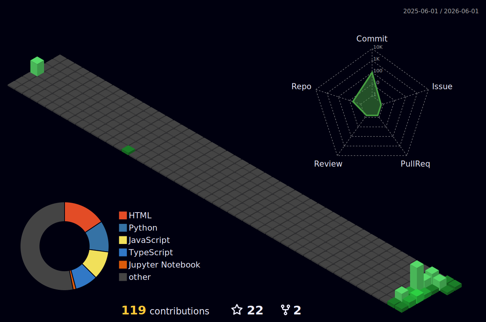

# Hi, I am Abhijat Chaturvedi 👋

### 🧠 Senior AI Lead | 🔬 Applied AI Scientist | 🤖 Machine Learning Engineer

🚀 I build practical AI systems that move from research ideas to real products.

---

## 👨‍💻 About Me

I work as a senior AI lead and applied machine learning scientist with 7+ years of experience across Generative AI, RAG, LLM agents, computer vision, healthcare intelligence, and applied ML systems.

I enjoy the space where research and engineering meet: taking a promising idea, testing it honestly, and shaping it into something reliable enough for real users.

- 🔭 Currently working on AI chat systems, knowledge assistants, RAG pipelines, vector search, multimodal workflows, and agent-based systems.
- 🌱 Interested in reliable LLM applications, practical computer vision, AI product engineering, and healthcare AI.
- 🛠️ Previously worked on image enhancement, super resolution, image harmonization, recommendation systems, government chatbots, and pandemic dashboards.
- ✍️ I also write literature on Medium as a personal hobby.

---

## 🧭 Areas I Work In

  
  
  
  
  
  
  

---

## 🧠 My Tech Stack

### 🧩 Core Languages

  

---

### ⚙️ Frameworks & Libraries

  
   
  
  
  
  
  

---

### 🗄️ Databases & Tools

  

---

## 🚀 Github Insights

  <picture>
    <source media="(prefers-color-scheme: dark)" srcset="https://raw.githubusercontent.com/abhijatchaturvedi/abhijatchaturvedi/output/github-snake-dark.svg" />
    <source media="(prefers-color-scheme: light)" srcset="https://raw.githubusercontent.com/abhijatchaturvedi/abhijatchaturvedi/output/github-snake.svg" />
    
  </picture>

   
   

  

   
   

  

---

## 📞 Connect

---

**🔬 Research-minded. 🧩 Product-aware. 🤝 Human about the work.**

